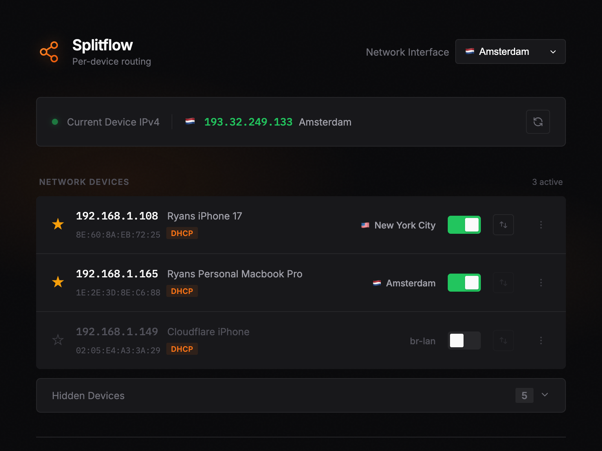

<p align="center">
  
</p>

<h1 align="center">Splitflow</h1>

<p align="center">
  Per-device routing for OpenWRT
</p>

---

<p align="center">
  
</p>

## Features

- Toggle VPN routing per device
- Favorite devices for quick access
- Custom device naming
- Multiple VPN interface support

## Quick Start

```bash
# Deploy to router
make deploy ROUTER_HOST=192.168.1.1 SSH_KEY=~/.ssh/openwrt

# Install as service (auto-start on boot + auto-restart on crash)
make install-service ROUTER_HOST=192.168.1.1 SSH_KEY=~/.ssh/openwrt

open https://192.168.1.1:8080
```

Options:
- `CONFIG_FILE=config.json` - Use custom config file
- `SSH_KEY=~/.ssh/openwrt` - SSH key for router access

## TLS Configuration

TLS is **enabled by default**. The server expects certificate files at:
- Certificate: `/etc/pbr-vpn/cert.pem`
- Private key: `/etc/pbr-vpn/key.pem`

### Generating Self-Signed Certificates

Generate a self-signed certificate on your router:

```bash
# SSH to your router
ssh root@192.168.1.1

# Create certificate directory
mkdir -p /etc/pbr-vpn

# Generate self-signed certificate (valid for 365 days)
openssl req -x509 -newkey rsa:2048 -keyout /etc/pbr-vpn/key.pem \
  -out /etc/pbr-vpn/cert.pem -days 365 -nodes \
  -subj "/CN=pbr-vpn" \
  -addext "subjectAltName=IP:192.168.1.1"
```

Replace `192.168.1.1` with your router's IP address.

### Trusting the Self-Signed Certificate

Since the certificate is self-signed, browsers will show a security warning. You can:

1. **Accept the warning** - Click "Advanced" → "Proceed" in your browser
2. **Trust the certificate permanently**:

**macOS:**
```bash
# Copy cert from router and add to Keychain
scp root@192.168.1.1:/etc/pbr-vpn/cert.pem /tmp/pbr-vpn.pem
sudo security add-trusted-cert -d -r trustRoot -k /Library/Keychains/System.keychain /tmp/pbr-vpn.pem
```

**Linux:**
```bash
scp root@192.168.1.1:/etc/pbr-vpn/cert.pem /usr/local/share/ca-certificates/pbr-vpn.crt
sudo update-ca-certificates
```

**Windows:**
```powershell
# Import to Trusted Root store
certutil -addstore -f "ROOT" cert.pem
```

### Disabling TLS

To run in HTTP-only mode:

```bash
# Via command line
./pbr-vpn -tls=false

# Via config.json
{
  "tls_enabled": false
}
```

## Configuration

Create `config.json` for multiple VPN interfaces:

```json
{
  "listen_addr": ":8080",
  "vpn_interfaces": [
    {"name": "vpn_amsterdam", "display_name": "Amsterdam"},
    {"name": "vpn_london", "display_name": "London"}
  ],
  "default_interface": "vpn_amsterdam",
  "dhcp_leases_path": "/tmp/dhcp.leases",
  "ethers_path": "/etc/ethers",
  "hosts_path": "/etc/hosts",
  "friendly_names": {
    "192.168.1.198": "Ryan's iPhone"
  }
}
```

### Configuration Options

| Option | Default | Description |
|--------|---------|-------------|
| `listen_addr` | `:8080` | Server listen address |
| `tls_enabled` | `true` | Enable HTTPS with TLS |
| `tls_cert_path` | `/etc/pbr-vpn/cert.pem` | Path to TLS certificate |
| `tls_key_path` | `/etc/pbr-vpn/key.pem` | Path to TLS private key |
| `vpn_interfaces` | - | List of VPN interfaces with display names |
| `default_interface` | - | Default VPN interface |
| `dhcp_leases_path` | `/tmp/dhcp.leases` | Path to DHCP leases file |
| `ethers_path` | `/etc/ethers` | Path to ethers file |
| `hosts_path` | `/etc/hosts` | Path to hosts file |
| `friendly_names` | - | Custom device names by IP |

## Troubleshooting

### "Failed to toggle VPN routing: exit status 2"

Check the logs for detailed error output:
```bash
make logs ROUTER_HOST=192.168.1.1 SSH_KEY=~/.ssh/openwrt
```

Common causes:

**Invalid interface in policy**: If a policy was created with an invalid interface (e.g., `br-lan` instead of a VPN interface), PBR validation will fail. Find and remove bad policies:
```bash
# SSH to router and list policies
uci show pbr | grep interface

# Delete policy with invalid interface (replace N with index)
uci delete pbr.@policy[N]
uci commit pbr
/etc/init.d/pbr reload
```

**PBR service not running**:
```bash
/etc/init.d/pbr status
/etc/init.d/pbr start
```

## License

MIT
